## 说明😶
本项目主要用户掌纹特征提取，主要工作包含：

1. 手掌掌纹ROI提取
2. 特征提取网络设置
3. 特征网络训练预测

其中，掌纹提取部分，主要实现参照`palm_rpi_ext` 实现，核心调用出口位置为instance.py
训练与推理为 train_palm_ext.py 与 ext_detect.py
## 环境安装

以下环境需要特别注意：
base: Python 3.10.x 🙂
```bash
mim install mmcv==2.2.0
GPU torch 2.3.x
pip install numpy==1.26.4
pip install modelscope==1.15.0
```
注意，由于mmcv编译时间较长，因此，在本项目的 libs 当中有编译好的2.2版本

`
pip install ./libs/mmcv-2.2.0-py2.py3-none-any.whly
`

即可完成安装😃

## 掌纹ROI提取
当前方案，采用深度学习方案来完成掌纹ROI区域提取
1. 基于21个关键点检测矫正手部位置以及初始化ROI中心2. 基于ROI区域，采用深度学习模型进行手势识别 
   1. 停止使用mediapipe提供的模型
2. 取消基于HSV，Canny的边缘检测算法，采用深度学习方案
3. 基于PSO算法完成中心点与最佳半径的纠正

实际测试中发现，在点2足够效果较好时，PSO寻找到的ROI区域较为准确、
在后续的优化中，可以考虑使用其他的图像矫正方法，不适应21点检测。

当前流程：

    1. 21个手部关键点检测，确定图像旋转角度

    2. 基于手部关键点，初始化半径以及ROI区域圆心
    
    3. 基于图像分割，抽取手部区域，构建适应值函数

    4. 基于PSO结合适应值函数，完成ROI区域矫正

识别效果图如下：
从左到右从上到下😁
<div style="display: flex; flex-direction: row; flex-wrap: wrap">
   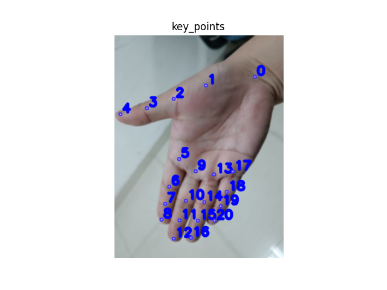
   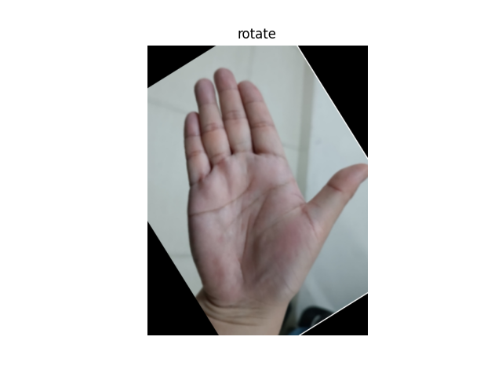
   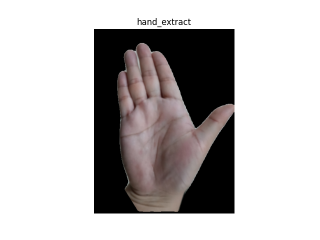
   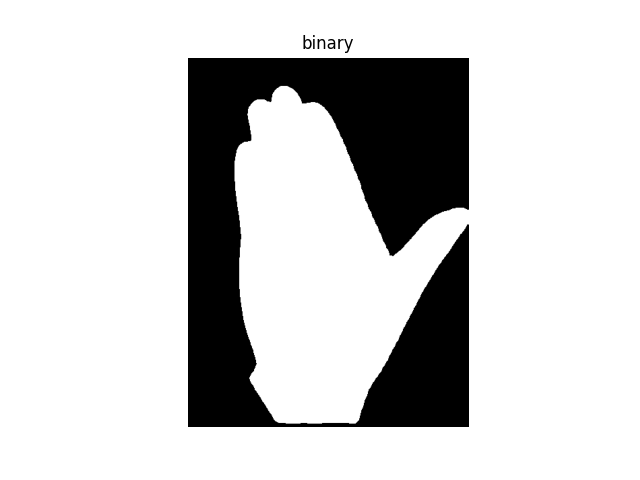
   
   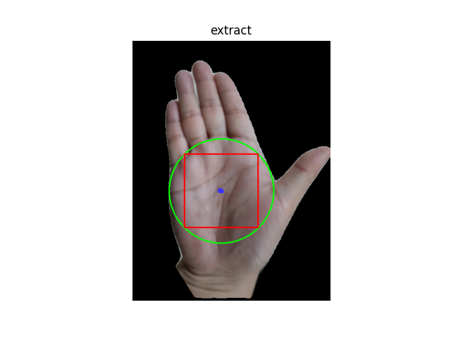
</div>

调用示例：
```python
 roi_extract = AutoRotateRoIExtract()
 draw_img,roi_square,roi_circle = roi_extract.roi_extract(img)
 roi_extract.show_image("extract",draw_img)
 roi_extract.show_image("roi_square",roi_square)
 roi_extract.show_image("roi_circle",roi_circle)
```
核心代码见`instance.py` 同时提供其他相关实例，具体见如下关系图：
<div style="display: flex; flex-direction: row; flex-wrap: wrap;justify-content: center">
   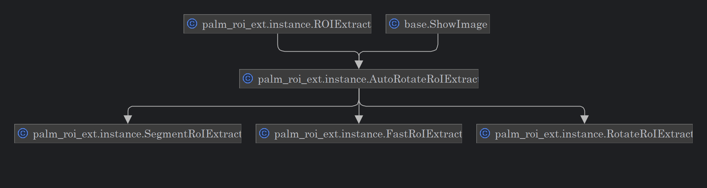
</div>

## PalmRecognition

掌纹特征提取识别，主要遵从如下流程：
<div style="display: flex; flex-direction: row; flex-wrap: wrap;justify-content: center">
   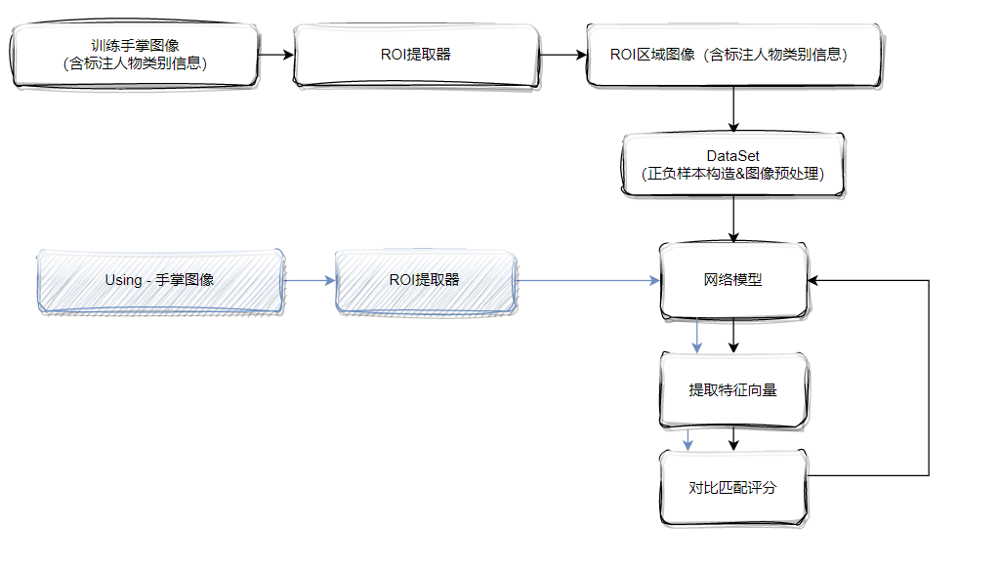
</div>

### 提取网络
  提取网络主要采用ResNet系列架构，替换最后一层FC全连接层为目标输出向量层。
  
掌纹特征提取任务需要处理大量的细节信息，包括纹线、褶皱等。这些特征既包含局部细节，又包含整体形状信息。传统的浅层网络很难同时捕捉这些多层次的特征。而 ResNet 的深层结构能够有效地提取多层次的特征，从小尺度的边缘和纹理特征到大尺度的整体形状特征。这对于掌纹识别非常重要。

其次，ResNet 的残差块设计解决了深层网络的训练问题。传统的深层网络容易出现退化问题，而 ResNet 通过引入跳跃连接（Skip Connection），有效解决了这一问题，使得深层网络也能稳定收敛。跳跃连接允许梯度更容易地向前传播，从而缓解梯度消失问题，确保网络在训练过程中能够学到有效的特征。

此外，ResNet 在大规模数据集（如 ImageNet）上的预训练模型可以用于迁移学习，显著提高模型在掌纹识别任务上的初始性能。预训练模型可以帮助模型更快地收敛，并减少过拟合的风险，特别是在数据量有限的情况下。

ResNet 学习到的特征具有较高的鲁棒性，能够在不同光照条件、角度变化等因素下保持较好的识别性能。同时，ResNet 学习到的特征具有较强的泛化能力，能够在不同的人群和不同的采集条件下保持较高的识别精度。

同时，ResNet 的设计相对简单，易于实现和训练，这对于快速开发和迭代模型非常有利。

### 数据集加载

在训练过程当中，数据集具备如下要素：
1. 包含手掌正面图像，手掌正面朝向，为2D数据集
2. 包含图像对应的类别信息，例如，当前手掌图像为第i个人的第j张的左手/右手图像
PS：由于左右手图像当中的掌纹并不一致，因此对应同一个人的左右手均作为不同类别处理
`class_key: person_id-l/r`
（第i个人的左手/右手）

数据集加载主要包含如下事件：
1. 读取图像路径，将图像信息归档整理为类别信息
```python 
{
    'key':[img0,img1,img2,...]
}
```
2. 加载图像时，构造正负样本，核心流程如下：
```python
1. 根据index加载图像1
2. 按照概率随机选择加载同一类别/不同类别的图像2
3. 根据图像2的类别信息，构造正负样本
```
3. 将图像转化为tensor，并放缩图像，对图像数据进行标准化（normalization）。将图像数据的像素值转换到一个特定的分布范围内。
这里的分部参数为：
```python
mean=[0.5, 0.5, 0.5]：表示每个通道的均值都是 0.5
std=[0.5, 0.5, 0.5]：表示每个通道的标准差都是 0.5
```
注意，这里并未直接采用ImageNet的参数
```python
mean=[0.485, 0.456, 0.406]
std=[0.229, 0.224, 0.225] 
```
具体可以看到下列处理后的图像：
<div style="display: flex; flex-direction: row; flex-wrap: wrap;gap: 10px">
   <div>
      <p style="font-size: 15px; text-align: center">原ROI图像</p>
      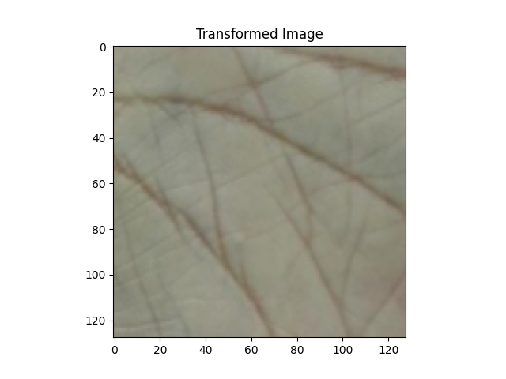
   </div>
   <div>
      <p style="font-size: 15px; text-align: center">imgNet设置</p>
      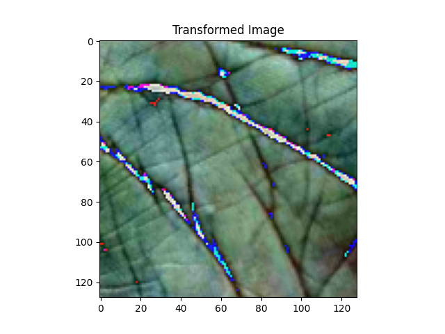
   </div>
   <div>
      <p style="font-size: 15px; text-align: center">Current or's 设置</p>
      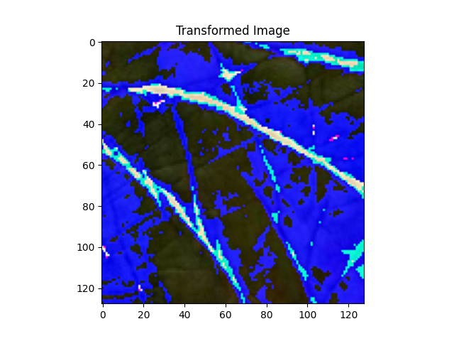
   </div>

</div>

### 损失函数

在当前发方案当中，主要提供了6个损失函数：

1. CosineSimilarityLoss：正负样本损失函数
2. ClassFiyOneLoss：当分类损失函数，使用该函数时将转化为分类问题训练（只是网络不具备最后一层分类全连接层而是只具备特征层）
3. ClassFiyTwoLoss：输入两组数据分类损失函数，其训练过程与分类一致，引入FAR，FFR 作为损失
4. CosineMarginOneLoss：度量学习损失函数，使用该损失函数时，不采用正负样本信息，而是与分类任务类似
5. CosineMarginTwoLoss：在原先的基础上，考虑正负样本
6. PalmCombinedLoss：结合1，3，5的损失函数

具体实现见 `palm_roi_net/models/loss.py`

其中，关于FAR,TAR等计算见 `class LossEval`

<div style="display: flex; flex-direction: row; flex-wrap: wrap;justify-content: center">
   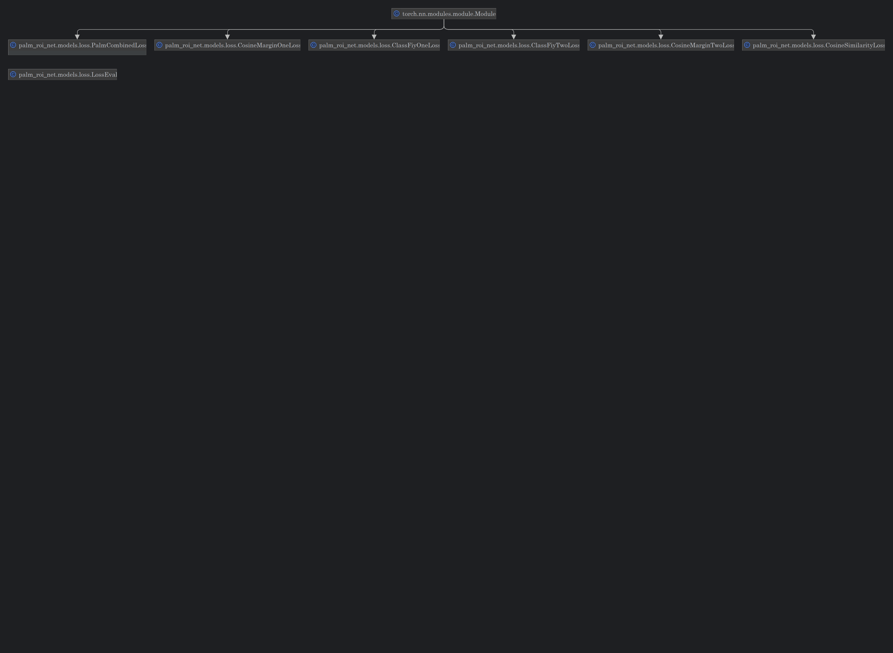
</div>

### Val Different Loss Function🙂

为节省时间与计算资源，当前验证基于resnet18，迭代训练200轮。
样本综述1.6W，提取类别400W，4：1 划分训练与测试集

PS: ClassFiyOneLoss 与 CosineMarginOneLoss 任务与分类任务类似，因此其Acc的评估采用分类评估（其未使用到正负样本，无法使用该方式计算）
```python
  # 计算分类损失 示例
  logits1 = self.feature_classes(output1)
  loss_class_1 = self.class_loss(logits1, class1)
  _, preds1 = torch.max(logits1, 1)

  # 比较预测结果与真实标签，得出准确率
  correct_predictions = (preds1 == class1).float()
  accuracy = torch.mean(correct_predictions)
  combined_loss = loss_class_1
```

---
其余损失函数，则主要评估正负样本
---
```python
  # 对于正样本，我们希望相似度得分大于 similarity_threshold
  # 对于负样本，我们希望相似度得分小于 similarity_threshold
  threshold = float(config_toml["TRAIN"]["similarity_threshold"])
  # 计算余弦相似度 [-1,1]
  similarity_scores = self.cosine_similarity(output1, output2)
  predictions = torch.where(similarity_scores >= threshold, torch.tensor(1, device=similarity_scores.device),
                            torch.tensor(-1, device=similarity_scores.device))

  # 比较预测结果与真实标签，得出准确率
  correct_predictions = (predictions == label).float()
  accuracy = torch.mean(correct_predictions)
```
这里主要展示相关数据：

1. ClassFiyTwoLoss
2. CosineMarginTwoLoss
3. PalmCombinedLoss

PS： 由于不同损失函数，计算方式不同，取值区间范围也不相同，主要查看其走势。

#### ClassFiyTwoLoss

<div style="display: flex; flex-direction: row; flex-wrap: wrap;gap: 10px">
   <div>
      <p style="font-size: 15px; text-align: center">训练损失</p>
      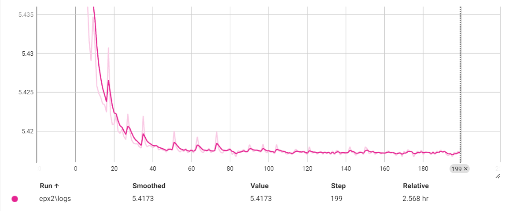
   </div>
   <div>
      <p style="font-size: 15px; text-align: center">训练准确率</p>
      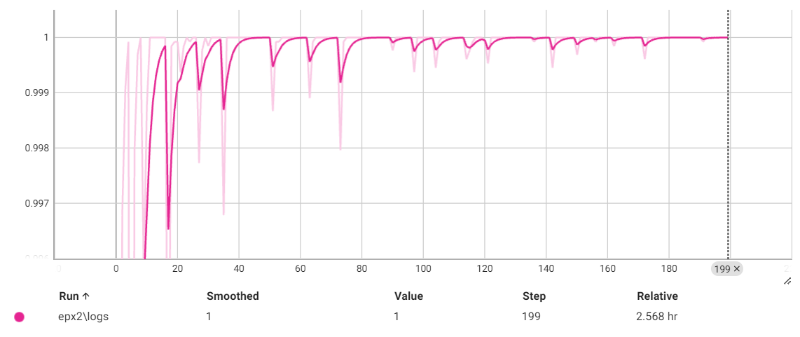
   </div>
   <div>
      <p style="font-size: 15px; text-align: center">测试损失</p>
      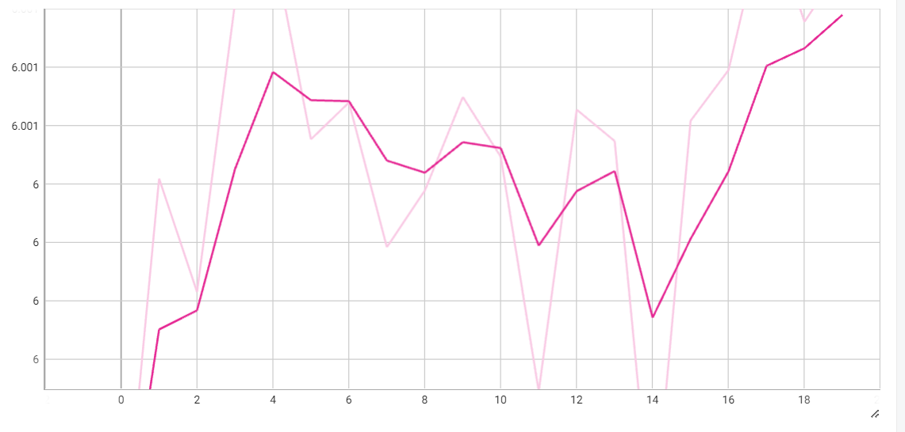
   </div>
   <div>
      <p style="font-size: 15px; text-align: center">测试准确率</p>
      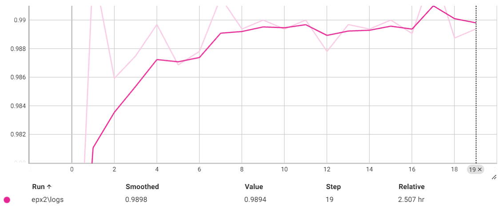
   </div>

</div>


#### CosineMarginTwoLoss

<div style="display: flex; flex-direction: row; flex-wrap: wrap;gap: 10px">
   <div>
      <p style="font-size: 15px; text-align: center">训练损失</p>
      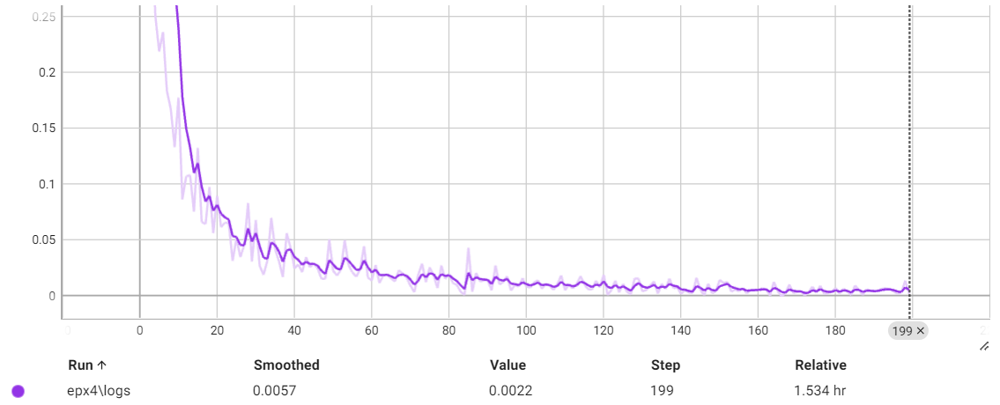
   </div>
   <div>
      <p style="font-size: 15px; text-align: center">训练准确率</p>
      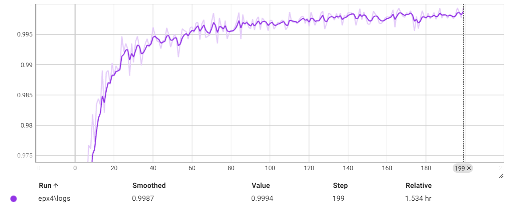
   </div>
   <div>
      <p style="font-size: 15px; text-align: center">测试损失</p>
      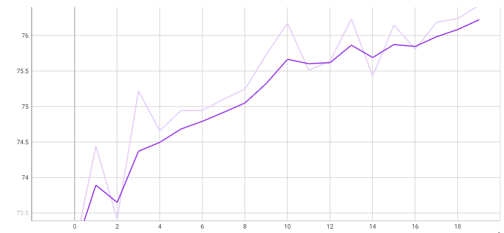
   </div>
   <div>
      <p style="font-size: 15px; text-align: center">测试准确率</p>
      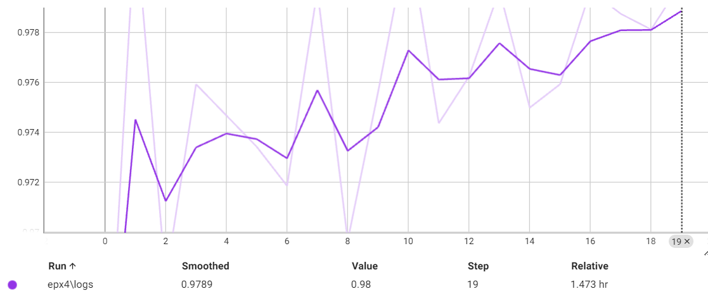
   </div>

</div>


#### PalmCombinedLoss

<div style="display: flex; flex-direction: row; flex-wrap: wrap;gap: 10px">
   <div>
      <p style="font-size: 15px; text-align: center">训练损失</p>
      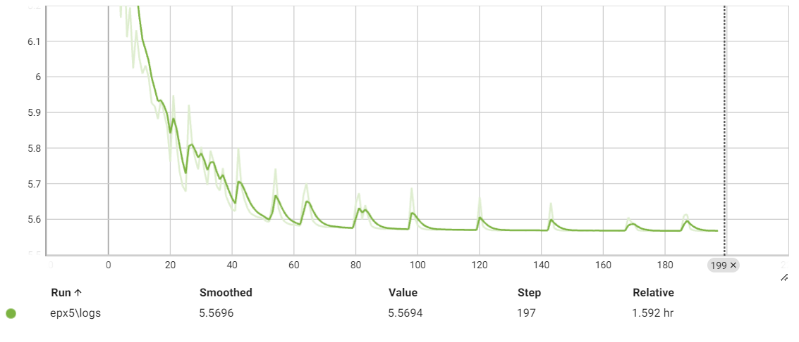
   </div>
   <div>
      <p style="font-size: 15px; text-align: center">训练准确率</p>
      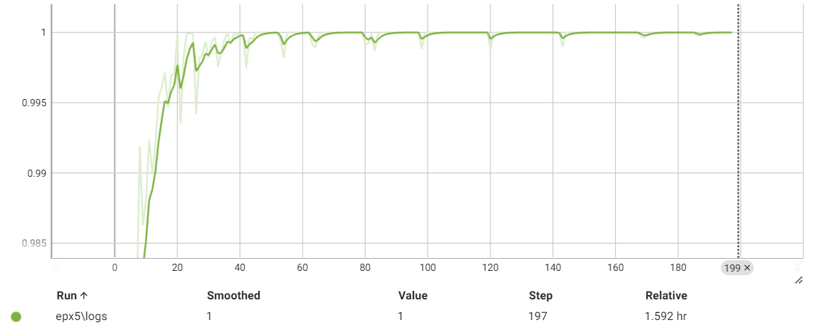
   </div>
   <div>
      <p style="font-size: 15px; text-align: center">测试损失</p>
      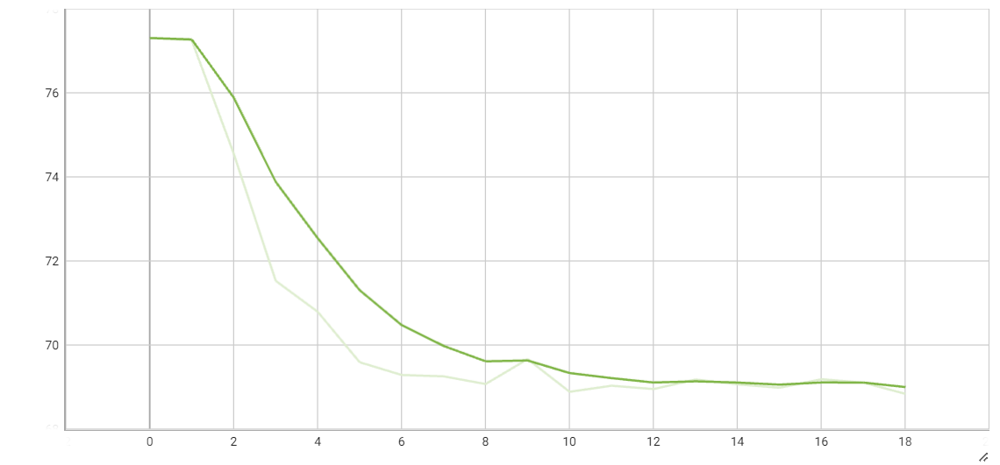
   </div>
   <div>
      <p style="font-size: 15px; text-align: center">测试准确率</p>
      
   </div>

</div>

更多评价指标，可通过tensorboard查看。

```python
tensorboard --logdir=runs/train_vec/ --port=6006 --host=0.0.0.0
```

