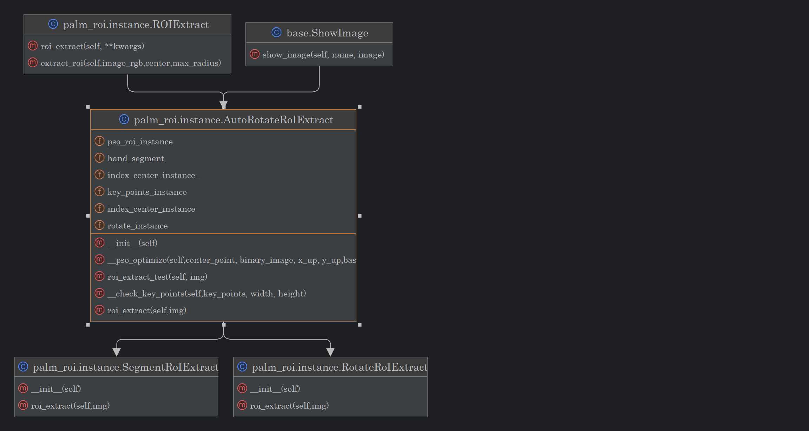

## 说明😶
本项目主要用户掌纹特征提取，主要工作包含：

1. 手掌掌纹ROI提取
2. 特征提取网络设置
3. 特征网络训练预测

其中，掌纹提取部分，主要实现参照`palm_rpi_ext` 实现，核心调用出口位置为instance.py

## 环境安装

当前项目环境，请根据下述环境自行安装

base: Python 3.10.x 🙂
```bash
pip install opencv-python
pip install -U openmim
mim install mmcv==2.2.0
GPU torch 2.3.x
pip install numpy==1.26.4
```
注意，由于mmcv编译时间较长，因此，在本项目的 libs 当中有编译好的2.2版本

`
pip install ./libs/mmcv-2.2.0-py2.py3-none-any.whly
`

即可完成安装😃

## 掌纹ROI提取
当前方案，采用深度学习方案来完成掌纹ROI区域提取
1. 基于21个关键点检测矫正手部位置以及初始化ROI中心2. 基于ROI区域，采用深度学习模型进行手势识别 
   1. 停止使用mediapipe提供的模型
2. 取消基于HSV，Canny的边缘检测算法，采用深度学习方案
3. 基于PSO算法完成中心点与最佳半径的纠正

实际测试中发现，在点2足够效果较好时，PSO寻找到的ROI区域较为准确、
在后续的优化中，可以考虑使用其他的图像矫正方法，不适应21点检测。

当前流程：

    1. 21个手部关键点检测，确定图像旋转角度

    2. 基于手部关键点，初始化半径以及ROI区域圆心
    
    3. 基于图像分割，抽取手部区域，构建适应值函数

    4. 基于PSO结合适应值函数，完成ROI区域矫正

识别效果图如下：
从左到右从上到下😁
<div style="display: flex; flex-direction: row; flex-wrap: wrap">
   
   
   
   
   
   
</div>

调用示例：
```python
 roi_extract = AutoRotateRoIExtract()
 draw_img,roi_square,roi_circle = roi_extract.roi_extract(img)
 roi_extract.show_image("extract",draw_img)
 roi_extract.show_image("roi_square",roi_square)
 roi_extract.show_image("roi_circle",roi_circle)
```
核心代码见`instance.py` 关系图如下所示：
<div style="display: flex; flex-direction: row; flex-wrap: wrap;justify-content: center">
   
</div>
